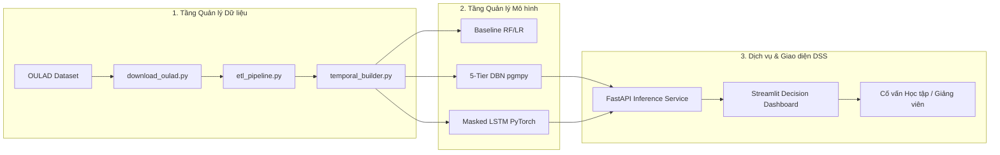

# Hệ Hỗ Trợ Ra Quyết Định (DSS) Cảnh Báo Nguy Cơ Học Tập Sinh Viên

> **Đồ án môn học:** Hệ thống Hỗ trợ Ra quyết định (*Decision Support Systems* - `IS254.R11`)  
> **Trường:** Trường Đại học Công nghệ Thông tin – ĐHQG-HCM (UIT)  
> **Giảng viên hướng dẫn:** Thầy Nguyễn Hồ Duy Trí  
> **Nhóm thực hiện (Nhóm 8):**  
> - **Bạch Hồ Bắc** – MSSV: `23520086`  
> - **Đặng Công An** – MSSV: `23520002`  

---

## 📌 Giới thiệu tổng quan

Trong môi trường giáo dục đại học và học trực tuyến, việc phát hiện chậm trễ sinh viên có nguy cơ rớt môn hoặc bỏ học (sau khi đã có điểm giữa kỳ hoặc cuối kỳ) khiến các biện pháp can thiệp của cố vấn học tập bị giảm hiệu quả.

Dự án này xây dựng hoàn chỉnh một **Hệ Hỗ trợ Ra quyết định (Decision Support System - DSS)** nhằm phát hiện sớm sinh viên có nguy cơ học tập theo tiến độ từng tuần trên bộ dữ liệu giáo dục công khai **OULAD (Open University Learning Analytics Dataset)**:
1. **5-Tier Dynamic Bayesian Network (DBN - `pgmpy`):** Học cấu trúc có ràng buộc thứ tự tầng (`HillClimbSearch` + `BIC`), suy luận xác suất trong điều kiện dữ liệu đầu kỳ còn khuyết (`VariableElimination`) và giải thích nhân quả từng yếu tố ảnh hưởng (`Delta P` — Explainable AI).
2. **Masked Many-to-Many LSTM (`PyTorch`):** Học chuỗi hành vi nộp bài, điểm số và tín hiệu bỏ nộp bài quá hạn từ tuần 1 đến tuần 20 không rò rỉ tương lai.
3. **Mô hình đối chứng (`scikit-learn`):** Random Forest & Logistic Regression trên đặc trưng tích lũy theo tuần.
4. **Hệ thống phần mềm DSS:** Đóng gói dịch vụ suy luận qua **FastAPI**, trực quan hóa qua **Streamlit Dashboard** phân loại 3 mức nguy cơ (`Low`, `Medium`, `High`) kèm khuyến nghị can thiệp sư phạm, và đóng gói bằng **Docker Compose**.

---

## 🏗️ Kiến trúc Hệ thống DSS


```mermaid
flowchart LR
    subgraph DataLayer ["1. Tầng Quản lý Dữ liệu"]
        A[OULAD Dataset] --> B[download_oulad.py]
        B --> C[etl_pipeline.py]
        C --> D[temporal_builder.py]
    end

    subgraph ModelLayer ["2. Tầng Quản lý Mô hình"]
        D --> M1[Baseline RF/LR]
        D --> M2[5-Tier DBN pgmpy]
        D --> M3[Masked LSTM PyTorch]
    end

    subgraph ServiceLayer ["3. Dịch vụ & Giao diện DSS"]
        M2 & M3 --> API[FastAPI Inference Service]
        API --> UI[Streamlit Decision Dashboard]
        UI --> Advisor[Cố vấn Học tập / Giảng viên]
    end
```

---

## 📂 Cấu trúc thư mục Repository

```text
IS254.R11/
├── .gitignore                        # Cấu hình bỏ qua dữ liệu thô >100MB, cache, venv
├── Dockerfile                        # Đóng gói container dịch vụ DSS
├── docker-compose.yml                # Khởi chạy đồng thời FastAPI (8000) & Streamlit (8501)
├── README.md                         # Tài liệu tổng quan & hướng dẫn vận hành hệ thống
├── requirements.txt                  # Danh sách thư viện Python
│
├── docs/                             # Tài liệu đề cương & báo cáo thực nghiệm
│   ├── DSS_plan.docx                 # Bản kế hoạch đồ án gốc (Word)
│   ├── DSS_plan.txt                  # Nội dung kế hoạch dạng văn bản
│   ├── experimental_results.md       # Bảng 4 chính thức (5-Fold CV) & so sánh cặp theo fold
│   ├── hypothesis_analysis.md        # Phân tích kiểm chứng giả thuyết H1, H2, H3 & RQ3
│   ├── temporal_holdout.md           # Kiểm tra tổng quát theo thời gian (học 2013 → đánh giá 2014)
│   └── README.md                     # Tóm tắt tài liệu dự án
│
├── data/                             # Quản lý dữ liệu dự án
│   ├── README.md                     # Từ điển dữ liệu 28 thuộc tính & hướng dẫn ETL
│   ├── raw/                          # Dữ liệu OULAD gốc (tải tự động qua script)
│   └── processed/                    # Dữ liệu sạch & kết quả thực nghiệm
│       ├── clean_data.csv            # 173.861 dòng x 28 cột (~22.5 MB)
│       ├── weekly_clicks.csv         # Click LMS theo tuần 1..20 của từng lượt đăng ký (~3.2 MB)
│       ├── benchmark_folds.csv       # Chi tiết kết quả từng fold trên 6 mốc tuần
│       └── benchmark_summary.csv     # Trung bình ± độ lệch chuẩn 5-Fold
│
├── models/                           # Trọng số mô hình đã huấn luyện sẵn sàng suy luận
│   ├── dbn_5tier.joblib              # Mạng 5-Tier DBN đã học cấu trúc & CPT
│   ├── lstm_masked.pt                # Trọng số Masked Many-to-Many LSTM & bộ chuẩn hóa
│   ├── baseline_rf_by_week.joblib    # Mô hình đối chứng Random Forest
│   └── sample_dbn_explanation.json   # Mẫu giải thích nhân quả DBN trên sinh viên thực tế
│
├── src/                              # Mã nguồn chính của hệ thống DSS
│   ├── data/
│   │   ├── download_oulad.py         # Tải tự động OULAD từ Figshare
│   │   ├── etl_pipeline.py           # Làm sạch & tạo đặc trưng chống rò rỉ dữ liệu
│   │   └── temporal_builder.py       # Cắt lát tuần T, bắt bài bỏ nộp quá hạn & tạo chuỗi 3D
│   ├── models/
│   │   ├── baseline.py               # Logistic Regression & Random Forest
│   │   ├── dbn_model.py              # 5-Tier DBN + Giải thích nhân quả Explainable AI
│   │   ├── lstm_model.py             # Masked Causal Many-to-Many LSTM
│   │   └── benchmark.py              # Kiểm định chéo 5-Fold StratifiedGroupKFold
│   ├── api/
│   │   ├── schemas.py                # Pydantic validation schemas
│   │   ├── service.py                # DSSInferenceEngine (Hybrid LSTM + DBN + Khuyến nghị)
│   │   └── main.py                   # REST API endpoints (/health, /cohort/overview, /predict/*)
│   └── dashboard/
│       └── app.py                    # Giao diện Streamlit Dashboard 4 phân hệ cho Cố vấn
│
├── tests/
│   └── test_leakage.py               # Kiểm thử chống rò rỉ thông tin tương lai (pytest)
│
└── notebooks/                        # Jupyter Notebooks trực quan hóa
    ├── 01_exploratory_data_analysis.ipynb
    ├── 05_model_evaluation.ipynb
    └── README.md
```

---

## ⚡ Hướng dẫn Cài đặt & Khởi chạy Hệ thống DSS

### 1. Cài đặt thư viện
```bash
git clone https://github.com/LiQiye2507/IS254.R11.git
cd IS254.R11
pip install -r requirements.txt
```

### 2. Tải dữ liệu gốc, chạy ETL & Huấn luyện lại (Tùy chọn — repo đã có sẵn `clean_data.csv` & `models/`)
```bash
python src/data/download_oulad.py
python src/data/etl_pipeline.py              # clean_data.csv + weekly_clicks.csv
python src/models/benchmark.py               # Kiểm định chéo 5-fold, lưu mô hình vào models/
python src/models/benchmark.py --temporal    # Học trên 2013, đánh giá trên 2014
python -m pytest tests -q                    # Kiểm thử chống rò rỉ dữ liệu
```

### 3. Khởi chạy Dịch vụ FastAPI & Giao diện Dashboard Streamlit

**Cách A — Chạy trực tiếp trên máy cục bộ:**
```bash
# Cửa sổ Terminal 1: Khởi động Backend FastAPI (http://127.0.0.1:8000/docs)
uvicorn src.api.main:app --host 127.0.0.1 --port 8000

# Cửa sổ Terminal 2: Khởi động Giao diện Dashboard DSS (http://localhost:8501)
streamlit run src/dashboard/app.py
```
*(Lưu ý: Ngay cả khi bạn chỉ chạy một lệnh `streamlit run src/dashboard/app.py` mà không bật cửa sổ FastAPI, Dashboard sẽ tự động chuyển sang chế độ `Direct Engine` nạp trực tiếp mô hình mà không bị lỗi kết nối).*

**Cách B — Khởi chạy trọn gói bằng Docker Compose:**
```bash
docker compose up --build
```
* **Swagger API Docs:** `http://localhost:8000/docs`
* **DSS Advisor Dashboard:** `http://localhost:8501`

---

## 📊 Tóm tắt Kết quả Thực nghiệm 5-Fold (`StratifiedGroupKFold` theo `id_student`)

Số in đậm là giá trị tốt nhất trong từng mốc tuần (cao nhất, riêng ECE là thấp nhất).

| Tuần | Mô hình | Accuracy | Recall (At-risk) | F1-Score | AUC-ROC | ECE ↓ |
| :-: | :--- | :-: | :-: | :-: | :-: | :-: |
| T = 2 | DBN (5-Tier) | 0.6083 ± 0.0234 | **0.8538 ± 0.0523** | 0.6792 ± 0.0029 | 0.7083 ± 0.0131 | 0.0532 ± 0.0069 |
| T = 2 | LSTM (Masked) | 0.6513 ± 0.0230 | 0.8290 ± 0.0487 | 0.6979 ± 0.0039 | 0.7560 ± 0.0086 | **0.0174 ± 0.0059** |
| T = 2 | Hybrid (DBN + LSTM) | 0.6475 ± 0.0195 | 0.8403 ± 0.0384 | 0.6985 ± 0.0041 | 0.7569 ± 0.0089 | 0.0225 ± 0.0107 |
| T = 2 | Đối chứng (RF) | **0.6569 ± 0.0180** | 0.8113 ± 0.0404 | 0.6966 ± 0.0068 | 0.7532 ± 0.0112 | 0.0361 ± 0.0079 |
| T = 2 | Đối chứng (LR) | 0.6536 ± 0.0236 | 0.8277 ± 0.0459 | **0.6990 ± 0.0032** | **0.7581 ± 0.0084** | 0.0186 ± 0.0037 |
| T = 8 | DBN (5-Tier) | 0.7363 ± 0.0075 | 0.7365 ± 0.0236 | 0.7306 ± 0.0072 | 0.8177 ± 0.0061 | 0.0477 ± 0.0059 |
| T = 8 | LSTM (Masked) | **0.7839 ± 0.0084** | 0.7660 ± 0.0192 | 0.7750 ± 0.0060 | 0.8682 ± 0.0048 | 0.0176 ± 0.0056 |
| T = 8 | Hybrid (DBN + LSTM) | 0.7808 ± 0.0121 | 0.7861 ± 0.0316 | **0.7770 ± 0.0042** | **0.8687 ± 0.0048** | 0.0182 ± 0.0041 |
| T = 8 | Đối chứng (RF) | 0.7748 ± 0.0094 | **0.7899 ± 0.0237** | 0.7731 ± 0.0053 | 0.8648 ± 0.0068 | 0.0233 ± 0.0045 |
| T = 8 | Đối chứng (LR) | 0.7758 ± 0.0105 | 0.7783 ± 0.0236 | 0.7713 ± 0.0057 | 0.8631 ± 0.0053 | **0.0133 ± 0.0037** |
| T = 16 | DBN (5-Tier) | 0.8281 ± 0.0045 | 0.8211 ± 0.0204 | 0.8227 ± 0.0030 | 0.9070 ± 0.0031 | **0.0175 ± 0.0038** |
| T = 16 | LSTM (Masked) | **0.8445 ± 0.0095** | **0.8262 ± 0.0221** | **0.8378 ± 0.0056** | 0.9247 ± 0.0034 | 0.0184 ± 0.0056 |
| T = 16 | Hybrid (DBN + LSTM) | 0.8439 ± 0.0138 | 0.8257 ± 0.0360 | 0.8373 ± 0.0078 | **0.9252 ± 0.0033** | 0.0177 ± 0.0037 |
| T = 16 | Đối chứng (RF) | 0.8397 ± 0.0113 | 0.8195 ± 0.0390 | 0.8325 ± 0.0053 | 0.9218 ± 0.0042 | 0.0180 ± 0.0043 |
| T = 16 | Đối chứng (LR) | 0.8359 ± 0.0081 | 0.8147 ± 0.0246 | 0.8283 ± 0.0038 | 0.9169 ± 0.0048 | 0.0182 ± 0.0033 |
| T = 20 | DBN (5-Tier) | 0.8638 ± 0.0064 | **0.8354 ± 0.0186** | 0.8563 ± 0.0052 | 0.9305 ± 0.0025 | **0.0141 ± 0.0011** |
| T = 20 | LSTM (Masked) | 0.8779 ± 0.0044 | 0.8300 ± 0.0117 | 0.8685 ± 0.0030 | 0.9452 ± 0.0026 | 0.0172 ± 0.0063 |
| T = 20 | Hybrid (DBN + LSTM) | **0.8792 ± 0.0041** | 0.8310 ± 0.0083 | **0.8699 ± 0.0031** | **0.9457 ± 0.0027** | 0.0162 ± 0.0046 |
| T = 20 | Đối chứng (RF) | 0.8785 ± 0.0051 | 0.8259 ± 0.0219 | 0.8684 ± 0.0073 | 0.9443 ± 0.0031 | 0.0174 ± 0.0037 |
| T = 20 | Đối chứng (LR) | 0.8714 ± 0.0086 | 0.8294 ± 0.0182 | 0.8625 ± 0.0055 | 0.9401 ± 0.0024 | 0.0170 ± 0.0053 |

*Lưu ý:* cả 5 mô hình dùng chung một tập Validation (15% sinh viên của tập huấn luyện mỗi fold) để chọn ngưỡng phân loại tối ưu F1. Hybrid chọn trọng số DBN (0–1, bước 0.1) tối ưu AUC trên cùng tập đó. ECE (Expected Calibration Error, 10 bin) càng thấp thì xác suất dự đoán càng sát tỷ lệ thực tế.

**Kết luận về các giả thuyết:**
- **H1** không được ủng hộ: ở T = 2, DBN có AUC-ROC và F1 thấp hơn LSTM ở cả 5 fold, và không ổn định hơn LSTM giữa các fold.
- **H2** được ủng hộ: từ T ≥ 4, LSTM có AUC-ROC và F1 cao hơn DBN ở mọi fold. Tuy vậy, LSTM chỉ nhỉnh hơn Random Forest rất ít (AUC-ROC dưới 0.004, F1 gần như bằng nhau).
- **RQ3 (Hybrid):** trọng số DBN được chọn chỉ 0–0.3, nên Hybrid gần như trùng LSTM (AUC-ROC cao hơn tối đa 0.001). Giá trị chính của DBN trong hệ thống là phần giải thích, không phải độ chính xác.
- **Hiệu chỉnh xác suất:** LSTM và Hybrid có ECE dưới 0.023 ở mọi mốc tuần; DBN lệch nhiều nhất ở đầu kỳ (ECE 0.05–0.06 tại T = 2–4).
- **Tổng quát theo thời gian:** học trên 2013, kiểm tra trên 2014, AUC-ROC giảm nhẹ (lớn nhất khoảng 0.03 tại T = 4) so với 5-fold. Chi tiết: [docs/temporal_holdout.md](docs/temporal_holdout.md).
- Bổ sung đặc trưng click LMS cải thiện AUC-ROC của mọi mô hình ở mọi mốc tuần, rõ nhất ở T = 2 (+0.075 đến +0.087).
- **H3** được ủng hộ: DBN cung cấp giải thích ΔP cho từng yếu tố, kể cả mức truy cập LMS.

*Bảng đầy đủ 6 mốc tuần và so sánh cặp theo fold: [docs/experimental_results.md](docs/experimental_results.md). Phân tích chi tiết và nguyên nhân: [docs/hypothesis_analysis.md](docs/hypothesis_analysis.md).*

---

## 🗓️ Tiến độ Hoàn thành Đồ án (Roadmap)

- [x] **Giai đoạn 1:** Khảo sát dữ liệu OULAD & xây dựng kế hoạch đồ án (`docs/DSS_plan.docx`).
- [x] **Giai đoạn 2:** Hoàn thiện ETL Pipeline (`src/data/etl_pipeline.py`) & Phân tích khám phá dữ liệu (`notebooks/01_exploratory_data_analysis.ipynb`).
- [x] **Giai đoạn 3:** Huấn luyện & kiểm định chéo 5-Fold cho Baseline, **5-Tier DBN (`pgmpy`)** và **Masked LSTM (`PyTorch`)** trên 6 mốc tuần (`src/models/`).
- [x] **Giai đoạn 4:** Xây dựng dịch vụ suy luận REST API với **FastAPI** (`src/api/`).
- [x] **Giai đoạn 5:** Phát triển giao diện **Streamlit Dashboard** cảnh báo sớm, giải thích nhân quả & khuyến nghị sư phạm (`src/dashboard/app.py`).
- [x] **Giai đoạn 6:** Đóng gói **Docker & Docker Compose** (`Dockerfile`, `docker-compose.yml`).

---

## 📖 Tài liệu tham khảo

1. **OULAD Dataset:** Kuzilek, J., Hlosta, M., & Zdrahal, Z. (2017). *Open University Learning Analytics Dataset*. Scientific Data, 4, 170171. DOI: [10.1038/sdata.2017.171](https://doi.org/10.1038/sdata.2017.171)
2. **Nghiên cứu tiền đề:** Tan et al. (2026). *Early Prediction of Student At-Risk Status using Dynamic Bayesian Networks*.
